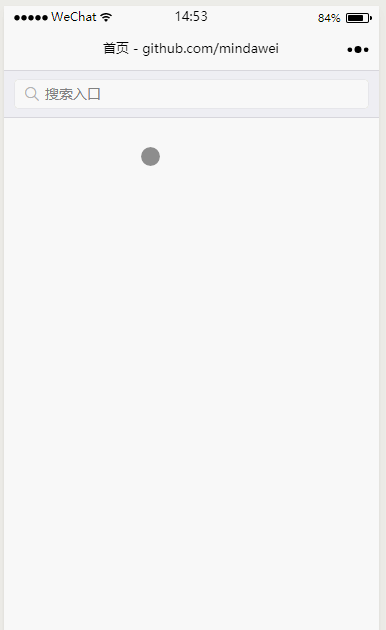

# wsSearchView
该搜索框组件基于开源项目<a href="https://github.com/icindy/wxSearch">wxSearch</a> 进行了改进，主要有以下几个修改点：
* 增加了注释，修改了一些bug，项目可以跑起来。
* 为了解决搜索框和输入法界面重叠的问题，将搜索组件作为一个独立的页面。
* 修改了界面样式，更加美观。
* 减少了暴露接口，复杂性更低。

下面左图是组件效果图，右边是基于这个组件开发的一个<a href="https://github.com/mindawei/weather">天气预报小程序</a>，扫描二维码可以进行体验。



# QuickStart
1. 拷贝项目根目录的wxSearchView文件夹到你项目的根目录下（也可以其它位置）。
2. 在你的wxss文件里导入组件的样式（文件位置为相对位置）：
```
@import "../../wxSearchView/wxSearchView.wxss";
```
3. 在你的wxml文件里导入组件（文件位置为相对位置）：
```
<include src="../../wxSearchView/wxSearchView.wxml" />
```
4. 在你的js文件里面添加以下代码,主要包括以下5个部分：
* 导入js文件
* 搜索栏初始化
* 转发函数
* 搜索回调函数
* 返回回调函数
```
// 1 导入js文件
var WxSearch = require('../../wxSearchView/wxSearchView.js');

Page({

  data: {},

  
  onLoad: function () {
  
    // 2 搜索栏初始化
    var that = this;
    WxSearch.init(
      that,  // 本页面一个引用
      ['杭州', '嘉兴', "海宁", "桐乡", '宁波', '金华'], // 热点搜索推荐，[]表示不使用
      ['湖北', '湖南', '北京', "南京"],// 搜索匹配，[]表示不使用
      that.mySearchFunction, // 提供一个搜索回调函数
      that.myGobackFunction //提供一个返回回调函数
    );
    
  },

  // 3 转发函数，固定部分，直接拷贝即可
  wxSearchInput: WxSearch.wxSearchInput,  // 输入变化时的操作
  wxSearchKeyTap: WxSearch.wxSearchKeyTap,  // 点击提示或者关键字、历史记录时的操作
  wxSearchDeleteAll: WxSearch.wxSearchDeleteAll, // 删除所有的历史记录
  wxSearchConfirm: WxSearch.wxSearchConfirm,  // 搜索函数
  wxSearchClear: WxSearch.wxSearchClear,  // 清空函数

  // 4 搜索回调函数  
  mySearchFunction: function (value) {
    // do your job here
    // 示例：跳转
    wx.redirectTo({
      url: '../index/index?searchValue='+value
    })
  },

  // 5 返回回调函数
  myGobackFunction: function () {
    // do your job here
    // 示例：返回
    wx.redirectTo({
      url: '../index/index?searchValue=返回'  
    })
  }

})
```

# 说明
## 回调函数
为了方便调用，提高开发效率，组件实际上只是提供了两个回调接口，开发者也只需要提供这两个函数，介绍如下：
1.  搜索回调函数，下面是一个例子。当用户点击历史记录、搜索热点、搜索提示、搜索按钮时，都会回调开发者提供的函数接口，开发者拿到参数后可以跳到另一个页面展示查询结果。
```
  mySearchFunction: function (value) {
    // do your job here
  }
```  
2. 返回回调函数，下面是一个例子。搜索框边上的按钮有两个角色，当输入为空的时候，是一个返回按钮；当输入不为空时，是一个搜索按钮。当点击返回按钮时，就会回调开发者提供的函数，这里可以跳回到指定页面。
```
  myGobackFunction: function () {
    // do your job here
  }
```

## 界面修改位置
为了提高开发者的开发效率，下表列出了了一些常用修改的位置。

| 界面效果       | 修改位置 | 
| ------------- |:-------------:| 
| 标签宽度       | wxSearchView.wxss -> .wxSearchKeyItem -> flex |
| 标签背景色     | wxSearchView.wxss -> .wxSearchKeyItem -> background-color |
| 页面背景色     | wxSearchView.wxss -> .wxSearch -> background-color |
| 提示面板背景色  | wxSearchView.wxss -> .wxSearchInner -> background-color |
| 返回按钮不需要 | wxSearchView.wxml -> 搜索 weui-search-bar__cancel-btn |
| 搜索提示修改 | wxSearchView.wxml -> 搜索 wxSearchMindKey |
| ... | ... |

## 帮助理解
1. 如果对微信中模块的提供方式不是很清楚的话，可以参考我之前的一篇介绍文章：<a href="https://wlwb.github.io/2018/01/09/%E5%BE%AE%E4%BF%A1%E5%B0%8F%E7%A8%8B%E5%BA%8F%E6%A8%A1%E5%9D%97%E7%BB%84%E4%BB%B6%E5%BC%80%E5%8F%91/">《微信小程序模块组件开发》</a>。
2. 本项目提供了一个使用demo，但是没有涉及到具体查询情况，更加完整的使用过程可以参考：<a href="https://github.com/mindawei/weather">天气预报小程序</a>。

